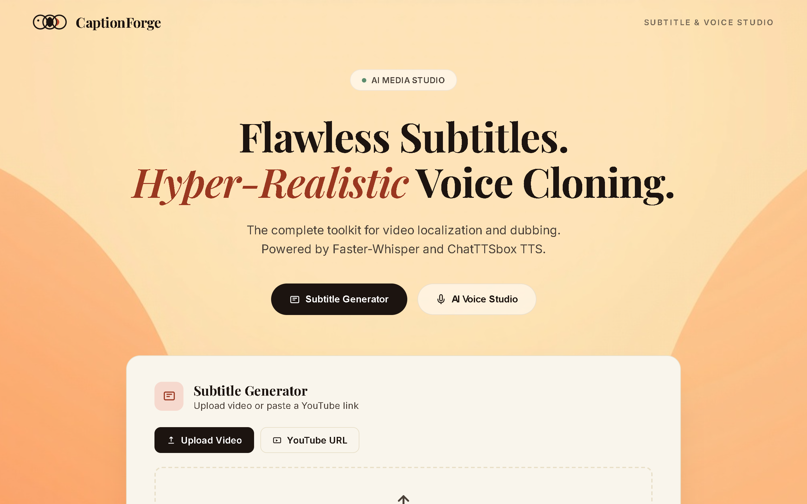

# CaptionForge & AI Voice Studio

A complete, modern toolkit for video localization, sub-titling, and hyper-realistic voice dubbing. Powered by Faster-Whisper for insanely fast transcriptions and ChatTTSbox for broadcast-quality voice cloning.

<p align="center">
  
</p>

### 🌐 Live Application
**Try it out here:** [https://gurshameer.github.io/CaptionForge/](https://gurshameer.github.io/CaptionForge/)

## ✨ Core Capabilities

### 🎬 Subtitle Generator
Automatically transcribe and perfectly sync subtitles for any video.
- **Upload Video or YouTube URL:** Drag and drop your local files or simply paste a YouTube link.
- **Powered by Faster-Whisper:** Fast and highly accurate transcriptions with automatic language detection.
- **Interactive UI:** See live progress with a beautiful step-by-step pipeline tracker.
- **Burn-in & Export:** Export transcripts as `.SRT` or `.VTT`, or automatically "burn in" the subtitles directly onto the video.

### 🎙️ AI Voice Studio
Generate hyper-realistic speech or clone any voice directly from your browser.
- **Voice Cloning:** Clone any voice using a short audio reference file (WAV, MP3, etc).
- **Expressiveness Controls:** Fine-tune the tone and emotion of the cloned voice with `Exaggeration` and `CFG Weight` controls.
- **Preset Voices:** Use high-quality studio voices tailored for different languages and accents.
- **One-Click Dubbing:** Seamlessly send your generated video transcript directly to the AI Voice Studio for instant dubbing.

---

## 🚀 Quick Start

This project consists of a React/Vite frontend and a FastAPI (Python) backend.

### 1. Prerequisites
- Node.js 18+ (for frontend)
- Python 3.10+ (for backend)
- Git

### 2. Backend Setup
```bash
cd backend
python -m venv .venv
# Activate the virtual environment
# Windows:
.venv\Scripts\activate
# Mac/Linux:
source .venv/bin/activate

pip install -r requirements.txt
python main.py
```
*The backend API will run at `http://127.0.0.1:8000`*

### 3. Frontend Setup
```bash
cd frontend
npm install
npm run dev
```
*The frontend will run at `http://localhost:5173`*

### 4. Or use the runner script (Windows only)
```bash
.\run.bat
```
This will automatically start both the backend and frontend servers in separate windows.

---

## 🛠️ Technology Stack

**Frontend:**
- React 19
- Vite
- Lucide React (Icons)
- Vanilla CSS with CSS Variables for a dynamic, modern Glassmorphism theme

**Backend:**
- Python & FastAPI
- Faster-Whisper (Audio Transcription)
- ChatTTSbox (Voice Cloning)
- FFmpeg (Video processing & Subtitle burn-in)

---

## 🎨 Design Philosophy
The application interface is built with a premium, modern aesthetic utilizing a custom color palette of Creams, Rusts, and Sage Greens. It features smooth micro-animations, glassmorphism overlays on scroll, and a clean, step-by-step progress UI that provides users with confidence during long-running background tasks.

## 📄 License
MIT License
